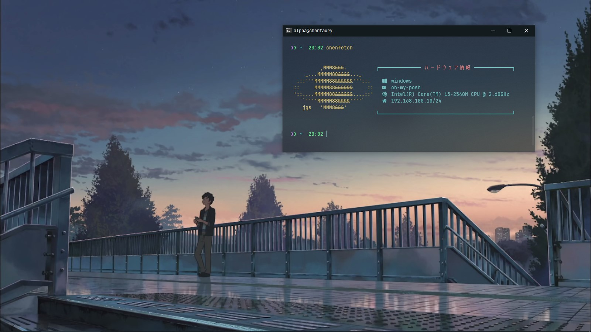

# Description
This is a screenfetch that I made myself, yes I made it with Golang, because I only know Golang :u. And i will make some theme :u 

## Usage
_**Windows**_

To usage you can run `chenfetch`
```
chenfetch
```
If you have scoop you can copy file `bin/chenfetch.exe` into folder `shims` in scoop folder


_**Linux**_

Copy file `chenfetch` to `/usr/bin`
```
cp bin/chenfetch /usr/bin/
chmod +x /usr/bin/chenfetch
```

To usage you can run `chenfetch`
```
chenfetch
```

## All Theme
_**[Titan Theme](./titan/)**_


_**[Janus Theme](./janus/)**_




_**[Pandora Theme](./pandora/)**_


> _Note: Theme will be update, stay tune :u_
