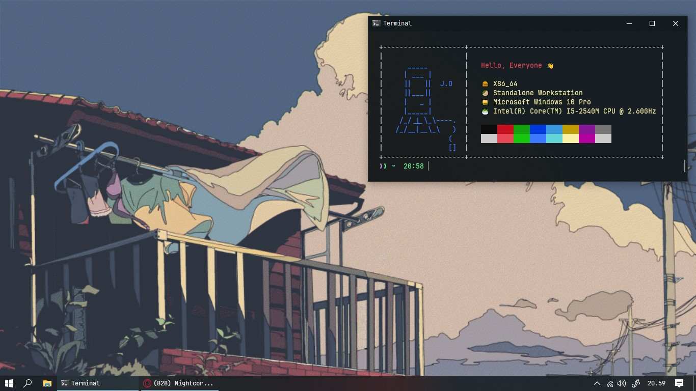

# Description
This is a screenfetch that I made myself, yes I made it with Golang, because I only know Golang :u

## Usage
To usage you can run `chenfetch`
```
chenfetch
```
If you have scoop you can copy file `chenfetch.exe` into folder `shims` in scoop folder

## Screenshot




