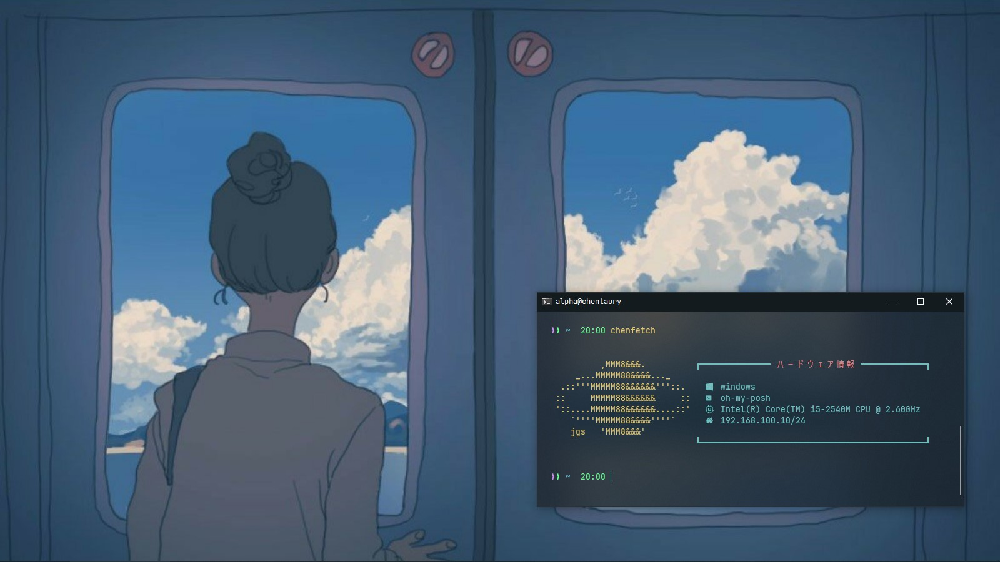

# Description
Theme Janus, if u like this you can follow instruction below

## Usage
_**Windows**_

To usage you can run `chenfetch`
```
chenfetch
```
If you have scoop you can copy file `bin/chenfetch.exe` into folder `shims` in scoop folder


_**Linux**_

Copy file `chenfetch` to `/usr/bin`
```
cp bin/chenfetch /usr/bin/
chmod +x /usr/bin/chenfetch
```

To usage you can run `chenfetch`
```
chenfetch
```

## Screenshot



    